# Strive 코드베이스 가이드 (현재 구현 범위)

이 문서는 **현재까지 구현된 범위(M0/M2/M3)**의 주요 코드가 **어떻게 동작하고 왜 이렇게 작성되었는지**를 설명한다.  
패키지 구조, 요청 흐름, 예외/응답 규격, 보안 설정, 테스트 구성까지 정리한다.

---

## 1) 애플리케이션 구조 개요

```
io.heygw44.strive
├── StriveApplication              # Spring Boot 엔트리포인트
├── domain
│   ├── user                       # 사용자/인증/프로필 도메인
│   ├── meetup                     # 모임 CRUD/조회 도메인
│   └── participation              # 참여(신청/취소/승인/거절) 도메인
├── global
│   ├── config                     # 보안/JPA Auditing 설정
│   ├── entity                     # 공통 엔티티 (BaseTimeEntity)
│   ├── exception                  # 예외 코드/핸들러
│   ├── filter                     # 공통 필터
│   ├── response                   # 공통 응답 포맷
│   └── security                   # 커스텀 UserDetails
└── support                        # 테스트용 컨트롤러
```

### 핵심 설계 의도
- **Controller는 얇게**, Service는 비즈니스 규칙을 담당.
- **도메인 엔티티가 상태 변경 책임**을 가진다.
- 예외는 **ErrorCode + BusinessException**으로 일관 처리.
- 보안(세션/CSRF)은 **Spring Security 표준 흐름**을 따른다.

---

## 2) 애플리케이션 시작

### `StriveApplication`
Spring Boot 앱의 엔트리 포인트다. 별도 설정 없이 기본 자동 구성으로 부팅된다.  
파일: `src/main/java/io/heygw44/strive/StriveApplication.java`

---

## 3) 공통 응답 포맷

### `ApiResponse<T>`
모든 정상 응답은 `{ data, traceId }` 형식으로 반환한다.  
`traceId`는 MDC에 저장된 값을 사용한다.
- 파일: `src/main/java/io/heygw44/strive/global/response/ApiResponse.java`

### `ErrorResponse`
에러는 `{ code, message, traceId, fieldErrors }` 형식으로 반환한다.  
Validation 에러는 `fieldErrors`에 필드별 메시지를 담는다.
- 파일: `src/main/java/io/heygw44/strive/global/response/ErrorResponse.java`
- 파일: `src/main/java/io/heygw44/strive/global/response/FieldError.java`

### `PageResponse<T>`
목록 응답을 위한 표준 페이지 포맷(모임 목록 응답에 사용).
- 파일: `src/main/java/io/heygw44/strive/global/response/PageResponse.java`

---

## 4) 공통 예외 처리

### `ErrorCode`
코드/메시지/HTTP 상태를 정의한다. 인증/검증/리소스 관련 에러들이 포함됨.
- 파일: `src/main/java/io/heygw44/strive/global/exception/ErrorCode.java`

### `BusinessException`
도메인/서비스 계층에서 비즈니스 규칙 위반 시 발생시키는 예외.
- 파일: `src/main/java/io/heygw44/strive/global/exception/BusinessException.java`

### `GlobalExceptionHandler`
모든 예외를 `ErrorResponse`로 매핑한다.
- `BusinessException` → 해당 ErrorCode로 응답
- `MethodArgumentNotValidException` → REQ-400 + fieldErrors
- `SessionAuthenticationException` → 동시 로그인 제한 처리
  - 파일: `src/main/java/io/heygw44/strive/global/exception/GlobalExceptionHandler.java`

---

## 5) Trace ID 필터 (요청 추적)

### `TraceIdFilter`
요청 헤더 `X-Trace-Id`를 확인하여 없으면 UUID 생성.  
MDC에 저장하고 응답 헤더에도 동일한 값을 내려준다.
- 파일: `src/main/java/io/heygw44/strive/global/filter/TraceIdFilter.java`

**의도**: 로그와 응답을 연동해 요청 단위 추적이 가능하게 한다.

---

## 6) 보안 설정

### `SecurityConfig`
Spring Security의 핵심 정책을 정의한다.
- CSRF: 쿠키 기반 토큰(`CookieCsrfTokenRepository`) 사용, 로그인/회원가입은 CSRF 제외
- 세션:
  - `sessionFixation().newSession()`으로 세션 고정 공격 방지
  - `maximumSessions(1)`로 동시 로그인 제한
  - `SessionAuthenticationStrategy`를 직접 적용하여 로그인 시 위 정책이 실제로 실행되도록 구성
- 인가:
  - `/api/auth/signup`, `/api/auth/login` 공개
  - `/api/me/**`, `/api/auth/logout`, `/api/auth/verify-email/**`는 인증 필요
  - `/api/meetups/**`는 메소드별 인증 요구
  - 참여 API는 `/api/meetups/{meetupId}/participations` 경로 사용
  - 참여 목록 조회(GET)는 인증 필요, 나머지는 `/api/meetups/**` 정책으로 커버
- 인증 실패 시 401로 응답

파일: `src/main/java/io/heygw44/strive/global/config/SecurityConfig.java`

### `JpaAuditingConfig`
JPA Auditing 기능을 활성화하는 설정 클래스.
- `@EnableJpaAuditing`으로 `@CreatedDate`, `@LastModifiedDate` 자동 처리 활성화

파일: `src/main/java/io/heygw44/strive/global/config/JpaAuditingConfig.java`

### `BaseTimeEntity`
모든 엔티티의 공통 타임스탬프 필드를 관리하는 추상 클래스.
- `@MappedSuperclass`로 상속 전용 (별도 테이블 생성 안 함)
- `@CreatedDate`: 엔티티 생성 시 자동 설정 (`updatable = false`)
- `@LastModifiedDate`: 엔티티 수정 시 자동 갱신

```java
@MappedSuperclass
@EntityListeners(AuditingEntityListener.class)
@Getter
public abstract class BaseTimeEntity {
    @CreatedDate
    @Column(name = "created_at", nullable = false, updatable = false)
    private LocalDateTime createdAt;

    @LastModifiedDate
    @Column(name = "updated_at")
    private LocalDateTime updatedAt;
}
```

**상속 엔티티**: User, Meetup, Participation
**예외**: EmailVerificationToken은 `updatedAt`이 없어 `@CreatedDate`만 직접 적용

파일: `src/main/java/io/heygw44/strive/global/entity/BaseTimeEntity.java`

---

## 7) 인증/회원 도메인

### 7.1 User 엔티티
`User`는 사용자 기본 정보 + 프로필 정보를 가진다.
- `BaseTimeEntity` 상속 (createdAt/updatedAt 자동 관리)
- 이메일/닉네임은 유니크
- `isVerified`로 이메일 인증 여부 관리
- `updateProfile`은 **null이 아닌 값만 반영**(부분 업데이트)
- `verifyEmail()`로 인증 상태 전환

파일: `src/main/java/io/heygw44/strive/domain/user/entity/User.java`

### 7.2 EmailVerificationToken
이메일 인증 토큰을 관리한다.
- `@CreatedDate`로 생성 시간 자동 설정 (updatedAt 없음)
- 토큰은 UUID로 생성, 해시 값만 저장
- 만료 시간 15분
- `isValid()`가 유효성 판단(미사용 + 만료 전)

파일: `src/main/java/io/heygw44/strive/domain/user/entity/EmailVerificationToken.java`

### 7.3 StringListConverter
`List<String>`을 JSON 문자열로 저장하기 위한 JPA 컨버터.
- null/빈 값은 `"[]"`로 저장
- 파싱 실패 시 빈 리스트 반환

파일: `src/main/java/io/heygw44/strive/domain/user/entity/StringListConverter.java`

### 7.4 Repository
JPA 기반 저장/조회 인터페이스.
- `UserRepository`: 이메일/닉네임 중복 검사
  - 파일: `src/main/java/io/heygw44/strive/domain/user/repository/UserRepository.java`
- `EmailVerificationTokenRepository`: 토큰 조회/삭제
  - 파일: `src/main/java/io/heygw44/strive/domain/user/repository/EmailVerificationTokenRepository.java`

---

## 8) 인증/프로필 서비스 계층

### 8.1 AuthService
인증 관련 비즈니스 규칙의 중심.
- 회원가입: 중복/비밀번호 길이 검증 → 비밀번호 해시 → 저장
- 로그인: 이메일로 사용자 조회 → 비밀번호 매칭
- 이메일 인증 요청: 기존 토큰 삭제 후 새 토큰 저장
- 이메일 인증 확인: 토큰 유효성/소유자 확인 후 인증 처리

파일: `src/main/java/io/heygw44/strive/domain/user/service/AuthService.java`

### 8.2 ProfileService
프로필 조회/수정 로직 담당.
- 조회: 사용자 존재 여부 확인 후 `ProfileResponse`로 변환
- 수정: 닉네임 중복 체크 후 `User.updateProfile` 호출

파일: `src/main/java/io/heygw44/strive/domain/user/service/ProfileService.java`

---

## 9) 컨트롤러

### 9.1 AuthController
인증/세션 관련 HTTP 엔드포인트 제공.
- `POST /api/auth/signup` : 회원가입
- `POST /api/auth/login` : 로그인 및 세션 발급
  - AuthenticationManager로 인증 후
  - `SessionAuthenticationStrategy` 적용
  - `SecurityContextRepository`에 저장
- `POST /api/auth/logout` : 세션 무효화 + JSESSIONID 쿠키 만료
- `POST /api/auth/verify-email/request` : 이메일 인증 토큰 생성
- `POST /api/auth/verify-email/confirm` : 토큰 확인 후 인증 완료

파일: `src/main/java/io/heygw44/strive/domain/user/controller/AuthController.java`

### 9.2 ProfileController
- `GET /api/me` : 내 프로필 조회
- `PUT /api/me` : 내 프로필 수정 (부분 업데이트)

파일: `src/main/java/io/heygw44/strive/domain/user/controller/ProfileController.java`

---

## 10) DTO (요청/응답 모델)

### 요청 DTO
- `SignupRequest` : 이메일/비밀번호/닉네임 검증 포함
- `LoginRequest` : 이메일/비밀번호
- `ProfileUpdateRequest` : 닉네임/소개/지역/경험값 등 (부분 업데이트)
- `VerifyEmailConfirmRequest` : `"tokenId:rawToken"` 문자열

### 응답 DTO
- `SignupResponse`, `LoginResponse`, `ProfileResponse`

파일: `src/main/java/io/heygw44/strive/domain/user/dto/*`

---

## 11) 모임 도메인 (M2)

### 11.1 엔티티
- `Meetup`은 모임의 핵심 정보와 상태 전이 규칙을 가진다.
- `BaseTimeEntity` 상속 (createdAt/updatedAt 자동 관리)
- `MeetupStatus`는 상태 전이 가능한 흐름만 허용한다.
- `Category`, `Region`은 모임 분류/지역 정보를 제공한다.
- 소프트 삭제(`deletedAt`) 후에는 조회에서 제외된다.

파일:
- `src/main/java/io/heygw44/strive/domain/meetup/entity/Meetup.java`
- `src/main/java/io/heygw44/strive/domain/meetup/entity/MeetupStatus.java`
- `src/main/java/io/heygw44/strive/domain/meetup/entity/Category.java`
- `src/main/java/io/heygw44/strive/domain/meetup/entity/Region.java`

### 11.2 Repository
- `MeetupRepository`: 삭제 제외 조회, 필터/페이징 목록, 비관적 락 조회 제공
- `CategoryRepository`, `RegionRepository`: 카테고리/지역 조회 및 존재 검증

파일:
- `src/main/java/io/heygw44/strive/domain/meetup/repository/MeetupRepository.java`
- `src/main/java/io/heygw44/strive/domain/meetup/repository/CategoryRepository.java`
- `src/main/java/io/heygw44/strive/domain/meetup/repository/RegionRepository.java`

### 11.3 DTO (요청/응답)
- `CreateMeetupRequest`: 생성 요청 + Bean Validation
- `UpdateMeetupRequest`: 부분 업데이트 + 상태 전이 요청
- `MeetupResponse`, `MeetupListResponse`: 상세/목록 응답
- `MeetupSearchCondition`: 기본 OPEN + startAt 정렬

파일:
- `src/main/java/io/heygw44/strive/domain/meetup/dto/CreateMeetupRequest.java`
- `src/main/java/io/heygw44/strive/domain/meetup/dto/UpdateMeetupRequest.java`
- `src/main/java/io/heygw44/strive/domain/meetup/dto/MeetupResponse.java`
- `src/main/java/io/heygw44/strive/domain/meetup/dto/MeetupListResponse.java`
- `src/main/java/io/heygw44/strive/domain/meetup/dto/MeetupSearchCondition.java`

### 11.4 서비스 / 응답 조립기
- `MeetupService`: CRUD + 도메인 규칙 검증
  - 필드 수정은 **OPEN 상태에서만** 허용
  - 상태 전이는 전이 규칙으로 검증
  - 변경 사항 없는 수정 요청은 REQ-400
- `MeetupResponseAssembler`: 응답 DTO 조립 전담, 목록 조회 시 배치 조회로 N+1 방지

파일:
- `src/main/java/io/heygw44/strive/domain/meetup/service/MeetupService.java`
- `src/main/java/io/heygw44/strive/domain/meetup/service/MeetupResponseAssembler.java`

### 11.5 MeetupController
- `POST /api/meetups`: 모임 생성 (인증 필요)
- `GET /api/meetups`: 목록 조회 (필터/정렬/페이징)
- `GET /api/meetups/{id}`: 상세 조회
- `PUT /api/meetups/{id}`: 수정 (작성자만)
- `DELETE /api/meetups/{id}`: 소프트 삭제 (작성자만)

파일:
- `src/main/java/io/heygw44/strive/domain/meetup/controller/MeetupController.java`

---

## 12) 참여 도메인 (M3)

### 12.1 상태 전이 다이어그램

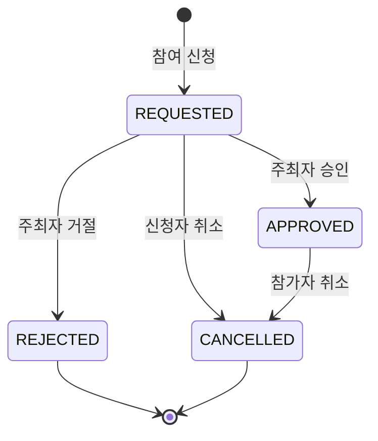

### 12.2 엔티티/상태 상세

#### ParticipationStatus (상태 전이 규칙)

```java
public enum ParticipationStatus {
    REQUESTED,  // 신청
    APPROVED,   // 확정
    REJECTED,   // 거절
    CANCELLED;  // 취소

    public boolean canTransitionTo(ParticipationStatus target) {
        return switch (this) {
            case REQUESTED -> target == APPROVED || target == REJECTED || target == CANCELLED;
            case APPROVED -> target == CANCELLED;
            case REJECTED, CANCELLED -> false;  // 최종 상태
        };
    }
}
```

| 현재 상태 | 전이 가능 대상 | 설명 |
|-----------|---------------|------|
| REQUESTED | APPROVED, REJECTED, CANCELLED | 신청 상태에서 모든 전이 가능 |
| APPROVED | CANCELLED | 확정 후 취소만 가능 |
| REJECTED | (없음) | 최종 상태 |
| CANCELLED | (없음) | 최종 상태 |

#### Participation 엔티티

```java
@Entity
@Table(name = "participation",
       uniqueConstraints = @UniqueConstraint(
           name = "uk_participation_meetup_user",
           columnNames = {"meetup_id", "user_id"}  // 동일 모임 중복 신청 방지
       ),
       indexes = {
           @Index(name = "idx_participation_meetup_status",
                  columnList = "meetup_id, status")  // 상태별 목록 조회 최적화
       })
public class Participation extends BaseTimeEntity {  // createdAt/updatedAt 자동 관리
    @Id @GeneratedValue(strategy = GenerationType.IDENTITY)
    private Long id;

    @Column(name = "meetup_id", nullable = false)
    private Long meetupId;

    @Column(name = "user_id", nullable = false)
    private Long userId;

    @Enumerated(EnumType.STRING)
    @Column(nullable = false, length = 20)
    private ParticipationStatus status;

    @Version
    private Integer version;  // 낙관적 락 (변경 충돌 감지)
    // ...
}
```

**주요 메서드:**

| 메서드 | 설명 | 예외 |
|--------|------|------|
| `Participation.request(meetupId, userId)` | 팩토리 메서드, REQUESTED 상태로 생성 | - |
| `approve()` | REQUESTED → APPROVED 전이 | PART-409-STATE |
| `reject()` | REQUESTED → REJECTED 전이 | PART-409-STATE |
| `cancel()` | REQUESTED/APPROVED → CANCELLED 전이 | PART-409-STATE |
| `isStatus(status)` | 현재 상태 확인 헬퍼 | - |
| `belongsToMeetup(meetupId)` | 모임 소속 확인 헬퍼 | - |

**내부 상태 전이 메커니즘:**

```java
private void transitionTo(ParticipationStatus newStatus) {
    if (!this.status.canTransitionTo(newStatus)) {
        throw new BusinessException(ErrorCode.PARTICIPATION_INVALID_STATE);
    }
    this.status = newStatus;
    this.updatedAt = LocalDateTime.now();
}
```

파일:
- `src/main/java/io/heygw44/strive/domain/participation/entity/Participation.java`
- `src/main/java/io/heygw44/strive/domain/participation/entity/ParticipationStatus.java`

### 12.3 Repository 상세

| 메서드 | 용도 | 락 모드 | 사용처 | AC |
|--------|------|---------|--------|-----|
| `existsByMeetupIdAndUserId` | 중복 신청 확인 | 없음 | 신청 | AC-PART-01 |
| `findByMeetupIdAndUserId` | 본인 참여 조회 | 없음 | 상태 조회 | - |
| `findByMeetupIdAndUserIdForUpdate` | 본인 참여 조회 (락) | PESSIMISTIC_WRITE | 취소 | AC-PART-03 |
| `findByIdForUpdate` | 참여 단건 조회 (락) | PESSIMISTIC_WRITE | 승인/거절 | AC-PART-02 |
| `countByMeetupIdAndStatus` | APPROVED 카운트 | 없음 | 정원 검증 | AC-PART-02 |
| `findByMeetupIdOrderByCreatedAtAsc` | 목록 조회 | 없음 | 주최자 목록 | - |

**PESSIMISTIC_WRITE 사용 예시:**

```java
@Lock(LockModeType.PESSIMISTIC_WRITE)
@Query("select p from Participation p where p.id = :participationId")
Optional<Participation> findByIdForUpdate(@Param("participationId") Long participationId);
```

파일:
- `src/main/java/io/heygw44/strive/domain/participation/repository/ParticipationRepository.java`

### 12.4 DTO (응답) 상세

**ParticipationResponse (단건):**

| 필드 | 타입 | 설명 |
|------|------|------|
| `id` | Long | 참여 ID |
| `meetupId` | Long | 모임 ID |
| `userId` | Long | 사용자 ID |
| `userNickname` | String | 사용자 닉네임 (조회 시 조인) |
| `status` | ParticipationStatus | 현재 상태 |
| `createdAt` | LocalDateTime | 신청 일시 |
| `updatedAt` | LocalDateTime | 최종 변경 일시 |

**ParticipationListResponse (주최자용 목록):**

| 필드 | 타입 | 설명 |
|------|------|------|
| `participations` | List\<ParticipationResponse\> | 참여 목록 |
| `totalCount` | long | 전체 신청 수 |
| `approvedCount` | long | 승인된 수 |
| `capacity` | int | 모임 정원 |

파일:
- `src/main/java/io/heygw44/strive/domain/participation/dto/ParticipationResponse.java`
- `src/main/java/io/heygw44/strive/domain/participation/dto/ParticipationListResponse.java`

### 12.5 서비스 상세 (핵심 비즈니스 로직)

#### requestParticipation() - 참여 신청

```
검증 순서: 모임 존재 → OPEN 상태 → 마감일 → 중복 체크
```

**흐름:**
1. `getMeetupOrThrow(meetupId)` - 모임 조회 (삭제 제외)
2. `validateMeetupOpenForParticipation(meetup)` - OPEN + 마감일 검증
3. `existsByMeetupIdAndUserId()` - 중복 신청 확인
4. `Participation.request()` - REQUESTED 상태로 생성
5. `save()` + `DataIntegrityViolationException` 처리

**동시성 처리:**
- 선 체크: `existsByMeetupIdAndUserId()`로 사전 검증
- 후 제약: UNIQUE 제약 위반 시 `DataIntegrityViolationException` → `PART-409-DUPLICATE` 매핑

```java
try {
    saved = participationRepository.save(participation);
} catch (DataIntegrityViolationException ex) {
    throw new BusinessException(ErrorCode.PARTICIPATION_DUPLICATE);
}
```

#### cancelParticipation() - 참여 취소

```
PESSIMISTIC_WRITE로 조회 → 상태 전이
```

**흐름:**
1. `findByMeetupIdAndUserIdForUpdate()` - 비관적 락으로 본인 참여 조회
2. `participation.cancel()` - REQUESTED/APPROVED → CANCELLED 전이

**허용 전이:** REQUESTED → CANCELLED, APPROVED → CANCELLED

#### getMyParticipation() - 본인 상태 조회

**흐름:**
1. `findByMeetupIdAndUserId()` - 락 없이 조회 (읽기 전용)
2. `toResponse()` - DTO 변환

#### approveParticipation() - 승인 (동시성 제어 핵심)

```
비관적 락 순서: 모임 락 → 참여 락 → 정원 검증 → 상태 전이
```

**흐름:**
1. `meetupRepository.findByIdForUpdate(meetupId)` - **모임에 비관적 락 획득** (정원 제어 핵심)
2. `validateOrganizer(meetup, organizerId)` - 주최자 권한 검증 → AUTH-403
3. `validateMeetupOpenForParticipation(meetup)` - 모임 상태/마감일 검증
4. `getParticipationForUpdateOrThrow(participationId)` - **참여에 비관적 락 획득**
5. `belongsToMeetup(meetupId)` - 참여가 해당 모임 소속인지 확인
6. `isStatus(REQUESTED)` - REQUESTED 상태만 승인 가능
7. `validateCapacity(meetup)` - 정원 초과 확인 → PART-409-CAPACITY
8. `participation.approve()` - APPROVED로 전이

**락 획득 순서의 중요성:**
모임 락을 먼저 획득하여 동일 모임의 동시 승인 요청을 직렬화한다.
이를 통해 정원 초과를 원천 방지한다 (AC-PART-02).

#### rejectParticipation() - 거절

```
참여에만 락 (정원 무관)
```

**흐름:**
1. `getMeetupOrThrow(meetupId)` - 모임 조회 (락 없음)
2. `validateOrganizer(meetup, organizerId)` - 주최자 권한 검증
3. `getParticipationForUpdateOrThrow(participationId)` - 참여에 비관적 락
4. `belongsToMeetup(meetupId)` - 소속 확인
5. `participation.reject()` - REJECTED로 전이

거절은 정원과 무관하므로 모임 락이 불필요하다.

#### getParticipations() - 주최자 목록

**흐름:**
1. `getMeetupOrThrow(meetupId)` - 모임 조회
2. `validateOrganizer(meetup, organizerId)` - 주최자 권한 검증
3. `findByMeetupIdOrderByCreatedAtAsc()` - 참여 목록 조회
4. **배치 사용자 조회** - N+1 방지

```java
List<Long> userIds = participations.stream()
    .map(Participation::getUserId)
    .distinct()
    .toList();

Map<Long, String> userNicknameMap = userRepository.findAllById(userIds).stream()
    .collect(Collectors.toMap(User::getId, User::getNickname));
```

파일:
- `src/main/java/io/heygw44/strive/domain/participation/service/ParticipationService.java`

### 12.6 컨트롤러 상세

| 엔드포인트 | 메서드 | 설명 | AC |
|-----------|--------|------|-----|
| `POST /api/meetups/{meetupId}/participations` | `requestParticipation` | 참여 신청 | AC-PART-01, AC-MEETUP-03 |
| `DELETE /api/meetups/{meetupId}/participations/me` | `cancelParticipation` | 본인 취소 | AC-PART-03, AC-PART-04 |
| `GET /api/meetups/{meetupId}/participations/me` | `getMyParticipation` | 본인 상태 | - |
| `PATCH /api/meetups/{meetupId}/participations/{pid}/approve` | `approveParticipation` | 주최자 승인 | AC-AUTH-03, AC-PART-02 |
| `PATCH /api/meetups/{meetupId}/participations/{pid}/reject` | `rejectParticipation` | 주최자 거절 | AC-AUTH-03, AC-PART-04 |
| `GET /api/meetups/{meetupId}/participations` | `getParticipations` | 주최자 목록 | AC-AUTH-03 |

**`@AuthenticationPrincipal` 사용 패턴:**

```java
@PostMapping
public ResponseEntity<ApiResponse<ParticipationResponse>> requestParticipation(
        @PathVariable Long meetupId,
        @AuthenticationPrincipal CustomUserDetails userDetails) {

    ParticipationResponse response = participationService.requestParticipation(
        meetupId, userDetails.getUserId());  // 인증된 사용자 ID 추출
    // ...
}
```

파일:
- `src/main/java/io/heygw44/strive/domain/participation/controller/ParticipationController.java`

---

## 13) API 시퀀스 다이어그램

### 로그인
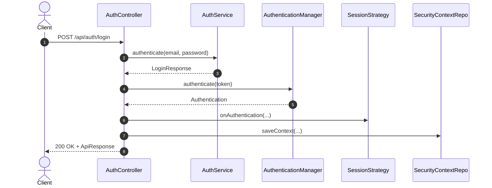

### 이메일 인증 요청
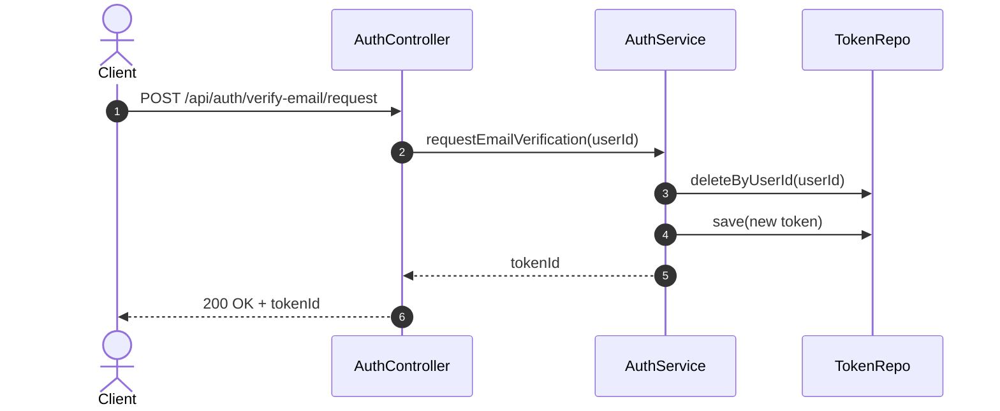

### 프로필 수정
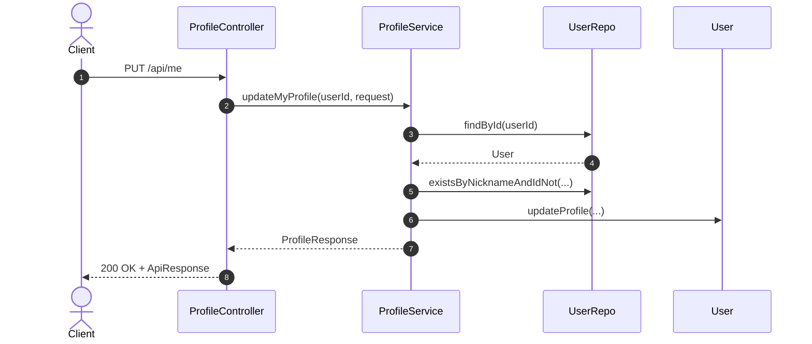

### 모임 생성
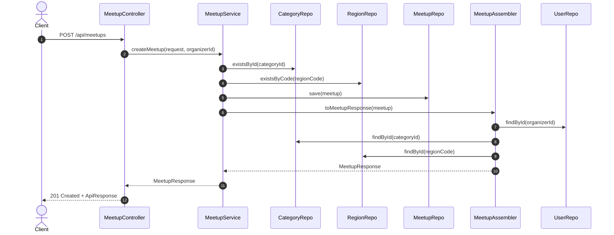

### 모임 목록 조회
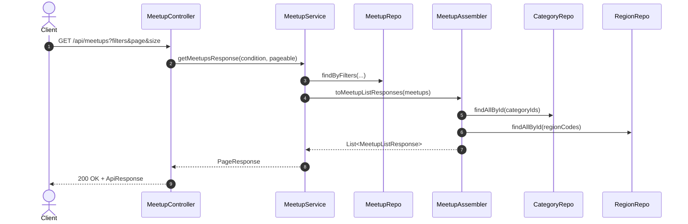

### 모임 수정
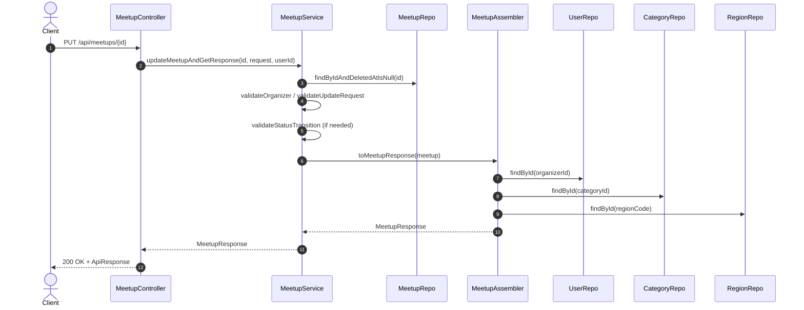

### 모임 삭제
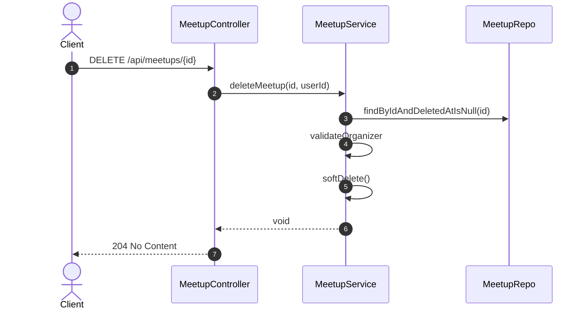

### 참여 신청
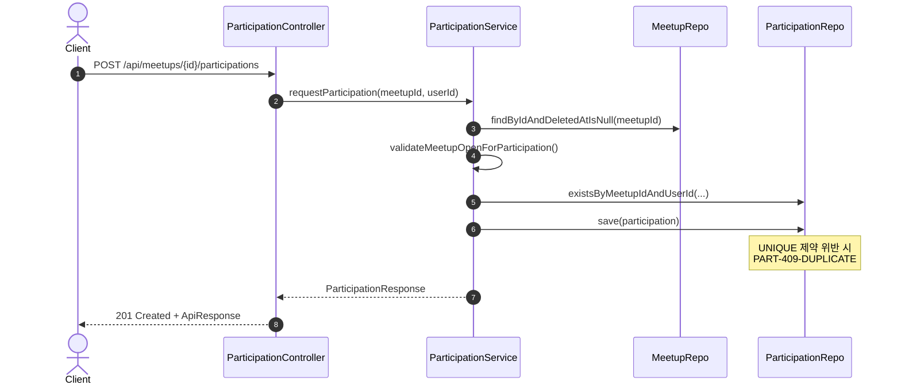

### 참여 취소
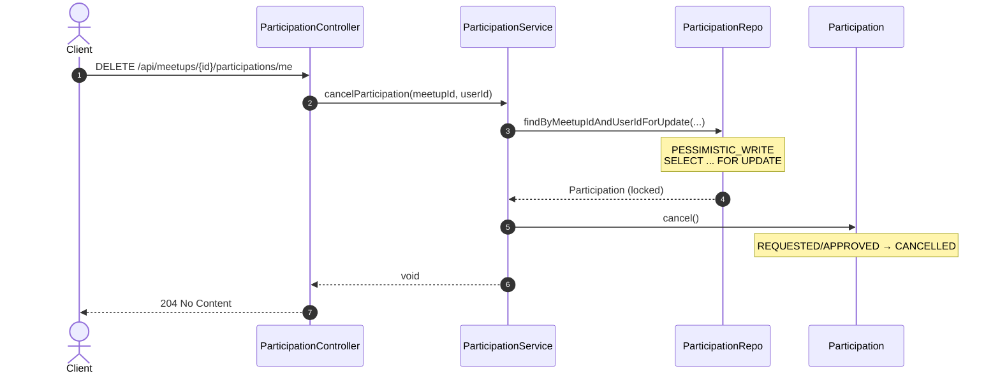

### 참여 승인 (동시성 제어)
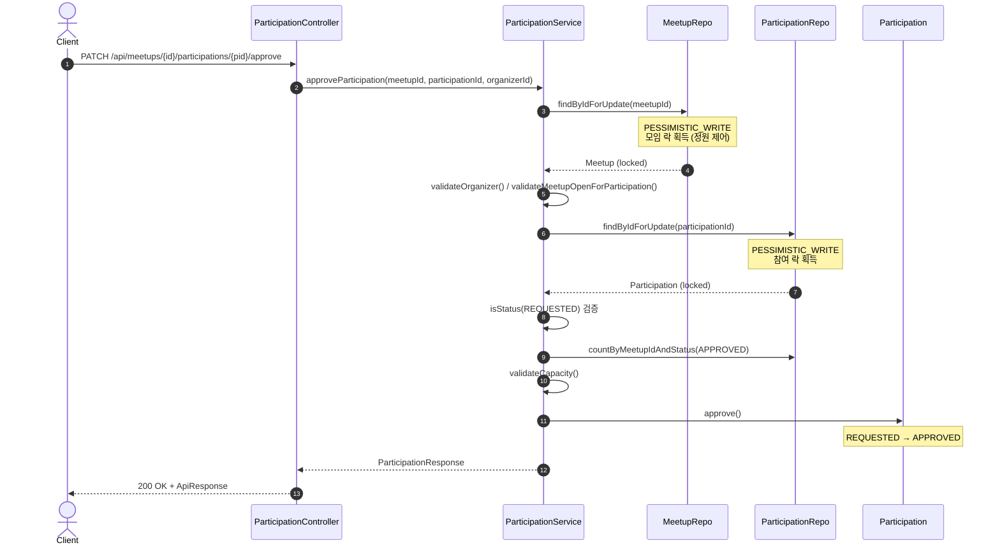

### 참여 거절
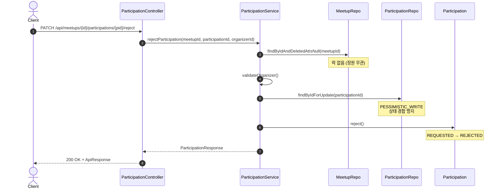

### 본인 참여 상태 조회
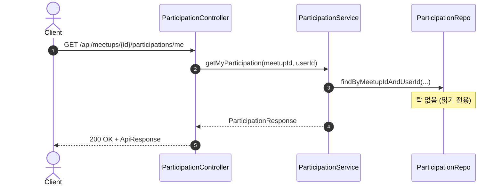

### 주최자 참여 목록 조회
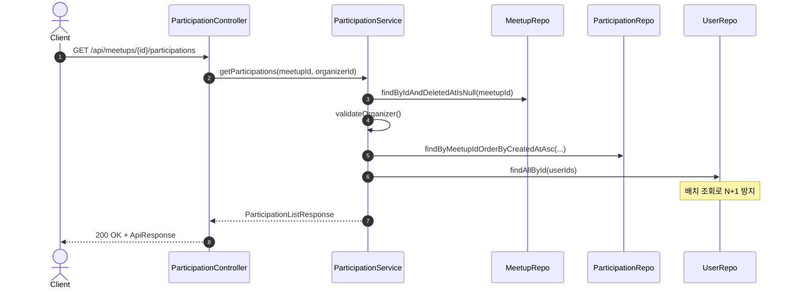

---

## 14) API 요청/응답 예시

### 모임 API 스펙 요약 (M2)

| API | 인증 | 요청 바디 | 응답 | 주요 에러 |
| --- | --- | --- | --- | --- |
| POST `/api/meetups` | 필요 | CreateMeetupRequest | MeetupResponse | REQ-400, RES-404, AUTH-401 |
| GET `/api/meetups` | 불필요 | 없음 | PageResponse\<MeetupListResponse> | REQ-400 |
| GET `/api/meetups/{id}` | 불필요 | 없음 | MeetupResponse | RES-404 |
| PUT `/api/meetups/{id}` | 필요 | UpdateMeetupRequest | MeetupResponse | REQ-400, AUTH-401, AUTH-403, RES-404, MEETUP-409-STATE |
| DELETE `/api/meetups/{id}` | 필요 | 없음 | 204 No Content | AUTH-401, AUTH-403, RES-404 |

### 모임 에러 케이스 (대표)
- REQ-400: 필수/형식 검증 실패, 변경 사항 없는 수정 요청
- RES-404: 존재하지 않거나 삭제된 모임/카테고리/지역
- AUTH-401: 인증되지 않은 요청
- AUTH-403: 작성자 권한 위반
- MEETUP-409-STATE: 허용되지 않는 상태 전이 또는 비-OPEN에서 필드 수정

### 참여 API 스펙 요약 (M3)

| API | 인증 | 요청 바디 | 응답 | 주요 에러 |
| --- | --- | --- | --- | --- |
| POST `/api/meetups/{id}/participations` | 필요 | 없음 | ParticipationResponse | AUTH-401, RES-404, MEETUP-409-STATE, MEETUP-409-DEADLINE, PART-409-DUPLICATE |
| DELETE `/api/meetups/{id}/participations/me` | 필요 | 없음 | 204 No Content | AUTH-401, RES-404, PART-409-STATE |
| GET `/api/meetups/{id}/participations/me` | 필요 | 없음 | ParticipationResponse | AUTH-401, RES-404 |
| PATCH `/api/meetups/{id}/participations/{pid}/approve` | 필요 | 없음 | ParticipationResponse | AUTH-401, AUTH-403, RES-404, MEETUP-409-STATE, MEETUP-409-DEADLINE, PART-409-CAPACITY, PART-409-STATE |
| PATCH `/api/meetups/{id}/participations/{pid}/reject` | 필요 | 없음 | ParticipationResponse | AUTH-401, AUTH-403, RES-404, PART-409-STATE |
| GET `/api/meetups/{id}/participations` | 필요 | 없음 | ParticipationListResponse | AUTH-401, AUTH-403, RES-404 |

### 회원가입
요청:
```http
POST /api/auth/signup
Content-Type: application/json

{
  "email": "new@example.com",
  "password": "password123",
  "nickname": "newuser"
}
```

응답:
```json
{
  "data": {
    "id": 1,
    "email": "new@example.com",
    "nickname": "newuser"
  },
  "traceId": "..."
}
```

### 로그인
요청:
```http
POST /api/auth/login
Content-Type: application/json

{
  "email": "test@example.com",
  "password": "password123"
}
```

응답:
```json
{
  "data": {
    "id": 1,
    "email": "test@example.com",
    "nickname": "testuser",
    "isVerified": false
  },
  "traceId": "..."
}
```

### 이메일 인증 토큰 요청
요청:
```http
POST /api/auth/verify-email/request
Content-Type: application/json
Cookie: JSESSIONID=...
```

응답:
```json
{
  "data": "token-id",
  "traceId": "..."
}
```

### 이메일 인증 확인
요청:
```http
POST /api/auth/verify-email/confirm
Content-Type: application/json
Cookie: JSESSIONID=...
X-CSRF-TOKEN: ...

{
  "token": "tokenId:rawToken"
}
```

응답:
```json
{
  "data": null,
  "traceId": "..."
}
```

### 내 프로필 조회
요청:
```http
GET /api/me
Cookie: JSESSIONID=...
```

응답:
```json
{
  "data": {
    "email": "test@example.com",
    "nickname": "testuser",
    "bioText": null,
    "preferredCategories": [],
    "homeRegionCode": null,
    "experienceLevel": null,
    "isVerified": false
  },
  "traceId": "..."
}
```

### 내 프로필 수정
요청:
```http
PUT /api/me
Content-Type: application/json
Cookie: JSESSIONID=...
X-CSRF-TOKEN: ...

{
  "nickname": "updatedNick",
  "bioText": "Updated bio text",
  "preferredCategories": ["HIKING", "CAMPING"],
  "homeRegionCode": "SEOUL_GANGNAM",
  "experienceLevel": "INTERMEDIATE"
}
```

응답:
```json
{
  "data": {
    "email": "test@example.com",
    "nickname": "updatedNick",
    "bioText": "Updated bio text",
    "preferredCategories": ["HIKING", "CAMPING"],
    "homeRegionCode": "SEOUL_GANGNAM",
    "experienceLevel": "INTERMEDIATE",
    "isVerified": false
  },
  "traceId": "..."
}
```

### 모임 생성
요청:
```http
POST /api/meetups
Content-Type: application/json
Cookie: JSESSIONID=...
X-CSRF-TOKEN: ...

{
  "title": "주말 러닝 모임",
  "description": "함께 러닝해요",
  "categoryId": 1,
  "regionCode": "SEOUL_GANGNAM",
  "locationText": "강남역 2번 출구",
  "startAt": "2026-02-07T09:00:00",
  "endAt": "2026-02-07T11:00:00",
  "recruitEndAt": "2026-02-06T23:59:00",
  "capacity": 10,
  "experienceLevelText": "초보자 환영"
}
```

응답:
```json
{
  "data": {
    "id": 1,
    "organizerId": 1,
    "organizerNickname": "organizer",
    "title": "주말 러닝 모임",
    "description": "함께 러닝해요",
    "categoryId": 1,
    "categoryName": "러닝",
    "regionCode": "SEOUL_GANGNAM",
    "regionName": "강남구",
    "locationText": "강남역 2번 출구",
    "startAt": "2026-02-07T09:00:00",
    "endAt": "2026-02-07T11:00:00",
    "recruitEndAt": "2026-02-06T23:59:00",
    "capacity": 10,
    "approvedCount": 0,
    "status": "DRAFT",
    "experienceLevelText": "초보자 환영",
    "createdAt": "2026-01-31T10:00:00",
    "updatedAt": "2026-01-31T10:00:00"
  },
  "traceId": "..."
}
```

### 모임 목록 조회 (필터/페이징)
요청:
```http
GET /api/meetups?regionCode=SEOUL_GANGNAM&sort=startAt&page=0&size=2
```

응답:
```json
{
  "data": {
    "items": [
      {
        "id": 1,
        "title": "주말 러닝 모임",
        "categoryId": 1,
        "categoryName": "러닝",
        "regionCode": "SEOUL_GANGNAM",
        "regionName": "강남구",
        "locationText": "강남역 2번 출구",
        "startAt": "2026-02-07T09:00:00",
        "recruitEndAt": "2026-02-06T23:59:00",
        "capacity": 10,
        "status": "OPEN",
        "createdAt": "2026-01-31T10:00:00"
      }
    ],
    "total": 1,
    "page": 0,
    "size": 2,
    "hasNext": false
  },
  "traceId": "..."
}
```

### 모임 수정
요청:
```http
PUT /api/meetups/1
Content-Type: application/json
Cookie: JSESSIONID=...
X-CSRF-TOKEN: ...

{
  "title": "주말 러닝 모임 (수정)",
  "description": "함께 러닝해요 - 업데이트"
}
```

응답:
```json
{
  "data": {
    "id": 1,
    "organizerId": 1,
    "organizerNickname": "organizer",
    "title": "주말 러닝 모임 (수정)",
    "description": "함께 러닝해요 - 업데이트",
    "categoryId": 1,
    "categoryName": "러닝",
    "regionCode": "SEOUL_GANGNAM",
    "regionName": "강남구",
    "locationText": "강남역 2번 출구",
    "startAt": "2026-02-07T09:00:00",
    "endAt": "2026-02-07T11:00:00",
    "recruitEndAt": "2026-02-06T23:59:00",
    "capacity": 10,
    "approvedCount": 0,
    "status": "OPEN",
    "experienceLevelText": "초보자 환영",
    "createdAt": "2026-01-31T10:00:00",
    "updatedAt": "2026-01-31T11:00:00"
  },
  "traceId": "..."
}
```

### 모임 삭제
요청:
```http
DELETE /api/meetups/1
Cookie: JSESSIONID=...
X-CSRF-TOKEN: ...
```

응답:
```http
204 No Content
```

### 참여 신청 (성공)
요청:
```http
POST /api/meetups/1/participations
Cookie: JSESSIONID=...
X-CSRF-TOKEN: ...
```

응답:
```json
{
  "data": {
    "id": 1,
    "meetupId": 1,
    "userId": 2,
    "userNickname": "participant1",
    "status": "REQUESTED",
    "createdAt": "2026-02-01T10:00:00",
    "updatedAt": "2026-02-01T10:00:00"
  },
  "traceId": "..."
}
```

### 참여 신청 (실패 - 중복)
요청:
```http
POST /api/meetups/1/participations
Cookie: JSESSIONID=...
X-CSRF-TOKEN: ...
```

응답:
```json
{
  "code": "PART-409-DUPLICATE",
  "message": "이미 신청한 모임입니다",
  "traceId": "...",
  "fieldErrors": null
}
```

### 참여 신청 (실패 - 모집 마감)
요청:
```http
POST /api/meetups/1/participations
Cookie: JSESSIONID=...
X-CSRF-TOKEN: ...
```

응답:
```json
{
  "code": "MEETUP-409-DEADLINE",
  "message": "모집 마감 이후입니다",
  "traceId": "...",
  "fieldErrors": null
}
```

### 참여 취소 (성공)
요청:
```http
DELETE /api/meetups/1/participations/me
Cookie: JSESSIONID=...
X-CSRF-TOKEN: ...
```

응답:
```http
204 No Content
```

### 참여 취소 (실패 - 상태 전이 불가)
요청:
```http
DELETE /api/meetups/1/participations/me
Cookie: JSESSIONID=...
X-CSRF-TOKEN: ...
```

응답 (이미 REJECTED 또는 CANCELLED 상태인 경우):
```json
{
  "code": "PART-409-STATE",
  "message": "허용되지 않는 참가 상태입니다",
  "traceId": "...",
  "fieldErrors": null
}
```

### 본인 참여 상태 조회
요청:
```http
GET /api/meetups/1/participations/me
Cookie: JSESSIONID=...
```

응답:
```json
{
  "data": {
    "id": 1,
    "meetupId": 1,
    "userId": 2,
    "userNickname": "participant1",
    "status": "APPROVED",
    "createdAt": "2026-02-01T10:00:00",
    "updatedAt": "2026-02-01T11:00:00"
  },
  "traceId": "..."
}
```

### 참여 승인 (성공)
요청:
```http
PATCH /api/meetups/1/participations/1/approve
Cookie: JSESSIONID=...
X-CSRF-TOKEN: ...
```

응답:
```json
{
  "data": {
    "id": 1,
    "meetupId": 1,
    "userId": 2,
    "userNickname": "participant1",
    "status": "APPROVED",
    "createdAt": "2026-02-01T10:00:00",
    "updatedAt": "2026-02-01T11:00:00"
  },
  "traceId": "..."
}
```

### 참여 승인 (실패 - 정원 초과)
요청:
```http
PATCH /api/meetups/1/participations/11/approve
Cookie: JSESSIONID=...
X-CSRF-TOKEN: ...
```

응답:
```json
{
  "code": "PART-409-CAPACITY",
  "message": "정원이 초과되었습니다",
  "traceId": "...",
  "fieldErrors": null
}
```

### 참여 승인 (실패 - 권한 없음)
요청 (주최자가 아닌 사용자가 요청):
```http
PATCH /api/meetups/1/participations/1/approve
Cookie: JSESSIONID=...
X-CSRF-TOKEN: ...
```

응답:
```json
{
  "code": "AUTH-403",
  "message": "권한이 없습니다",
  "traceId": "...",
  "fieldErrors": null
}
```

### 참여 거절 (성공)
요청:
```http
PATCH /api/meetups/1/participations/1/reject
Cookie: JSESSIONID=...
X-CSRF-TOKEN: ...
```

응답:
```json
{
  "data": {
    "id": 1,
    "meetupId": 1,
    "userId": 2,
    "userNickname": "participant1",
    "status": "REJECTED",
    "createdAt": "2026-02-01T10:00:00",
    "updatedAt": "2026-02-01T11:00:00"
  },
  "traceId": "..."
}
```

### 참여 거절 (실패 - 상태 전이 불가)
요청 (이미 APPROVED 상태인 참여):
```http
PATCH /api/meetups/1/participations/1/reject
Cookie: JSESSIONID=...
X-CSRF-TOKEN: ...
```

응답:
```json
{
  "code": "PART-409-STATE",
  "message": "허용되지 않는 참가 상태입니다",
  "traceId": "...",
  "fieldErrors": null
}
```

### 주최자 참여 목록 조회
요청:
```http
GET /api/meetups/1/participations
Cookie: JSESSIONID=...
```

응답:
```json
{
  "data": {
    "participations": [
      {
        "id": 1,
        "meetupId": 1,
        "userId": 2,
        "userNickname": "participant1",
        "status": "APPROVED",
        "createdAt": "2026-02-01T10:00:00",
        "updatedAt": "2026-02-01T11:00:00"
      },
      {
        "id": 2,
        "meetupId": 1,
        "userId": 3,
        "userNickname": "participant2",
        "status": "REQUESTED",
        "createdAt": "2026-02-01T10:30:00",
        "updatedAt": "2026-02-01T10:30:00"
      }
    ],
    "totalCount": 2,
    "approvedCount": 1,
    "capacity": 10
  },
  "traceId": "..."
}
```

---

## 15) 보안용 사용자 정보

### `CustomUserDetails`
Spring Security가 사용하는 사용자 모델.  
`User`를 감싸며 `ROLE_USER` 권한 부여.

### `CustomUserDetailsService`
이메일로 사용자를 조회해 `CustomUserDetails`를 반환한다.

파일:
- `src/main/java/io/heygw44/strive/global/security/CustomUserDetails.java`
- `src/main/java/io/heygw44/strive/global/security/CustomUserDetailsService.java`

---

## 16) 테스트 구성

### 통합 테스트
Spring Boot + MockMvc 기반.
- `AuthIntegrationTest`: 로그인/세션 재발급/CSRF/401/토큰 형식 검증
- `ProfileIntegrationTest`: 프로필 조회/수정/중복 닉네임 검증
- `MeetupIntegrationTest`: 모임 CRUD/필터/권한/상태 전이 검증
- `ParticipationIntegrationTest`: 참여 신청/취소/승인/거절/권한/정원 검증
- `GlobalExceptionHandlerTest`: 검증/비즈니스 예외 응답 확인
- `TraceIdFilterTest`: TraceId 생성/반환 확인

파일:
- `src/test/java/io/heygw44/strive/domain/user/controller/AuthIntegrationTest.java`
- `src/test/java/io/heygw44/strive/domain/user/controller/ProfileIntegrationTest.java`
- `src/test/java/io/heygw44/strive/domain/meetup/controller/MeetupIntegrationTest.java`
- `src/test/java/io/heygw44/strive/domain/participation/controller/ParticipationIntegrationTest.java`
- `src/test/java/io/heygw44/strive/global/exception/GlobalExceptionHandlerTest.java`
- `src/test/java/io/heygw44/strive/global/filter/TraceIdFilterTest.java`

### 단위 테스트
Mockito 기반 서비스 테스트.
- `AuthServiceTest`: 회원가입/로그인/토큰 요청 검증
- `MeetupServiceTest`: 모임 생성/수정/삭제 도메인 규칙 검증
- `MeetupStatusTest`: 상태 전이 규칙 검증
- `ParticipationStatusTest`: 참여 상태 전이 규칙 검증

파일:
- `src/test/java/io/heygw44/strive/domain/user/service/AuthServiceTest.java`
- `src/test/java/io/heygw44/strive/domain/meetup/service/MeetupServiceTest.java`
- `src/test/java/io/heygw44/strive/domain/meetup/entity/MeetupStatusTest.java`
- `src/test/java/io/heygw44/strive/domain/participation/entity/ParticipationStatusTest.java`

### 동시성 테스트
- `ParticipationConcurrencyTest`: 동일 사용자 동시 신청 시 1건 성공 + 중복 매핑 검증

파일:
- `src/test/java/io/heygw44/strive/domain/participation/service/ParticipationConcurrencyTest.java`

### 최근 테스트 실행 기록
- 2026-02-01 16:50:34 (로컬) `./gradlew test --tests io.heygw44.strive.domain.participation.service.ParticipationConcurrencyTest` 성공
- 2026-02-01 17:04:41 (로컬) `./gradlew test` 성공
- 2026-02-01 (로컬) `./gradlew build` 성공
- 2026-02-01 18:47:11 (로컬) `./gradlew test` 성공
- 2026-02-01 19:01:54 (로컬) `./gradlew test` 성공

---

## 17) 환경 설정

### `application.yaml`
기본 공통 설정.
- Jackson 시간대 UTC
- JPA Open Session 비활성화
- 세션 쿠키: `http-only=true`, `secure=true`, `same-site=lax`

파일: `src/main/resources/application.yaml`

### `application-local.yaml`
로컬 전용 설정.
- H2 인메모리 DB
- JPA create-drop
- 세션 쿠키 `secure=false` (로컬 HTTP 테스트용)

파일: `src/main/resources/application-local.yaml`

---

## 18) 개발 관점 요약 (왜 이렇게 작성했나)

1) **컨트롤러 얇게, 서비스에 규칙 집중**
   - 테스트와 유지보수에 유리.
2) **예외/응답 규격 통일**
   - 클라이언트가 에러 처리 일관되게 가능.
3) **보안은 표준 흐름**
   - 직접 구현보다 Spring Security 전략 사용이 안전.
4) **부분 업데이트는 null 보호**
   - 기존 데이터 손실 방지.
5) **응답 조립 책임 분리**
   - 조회 전용 로직을 분리해 서비스 복잡도를 낮춤.
6) **JPA Auditing으로 타임스탬프 자동 관리**
   - 수동 `LocalDateTime.now()` 설정 제거로 보일러플레이트 감소.
   - `BaseTimeEntity` 상속으로 일관성 보장.

---

## 19) 동시성 제어 전략 (M3 참여 도메인)

참여 도메인에서는 세 가지 동시성 제어 메커니즘을 조합하여 데이터 정합성을 보장한다.

### 19.1 비관적 락 (PESSIMISTIC_WRITE)

```java
@Lock(LockModeType.PESSIMISTIC_WRITE)
@Query("select m from Meetup m where m.id = :id and m.deletedAt is null")
Optional<Meetup> findByIdForUpdate(@Param("id") Long id);
```

**사용처:**

| 메서드 | 락 대상 | 목적 |
|--------|---------|------|
| `approveParticipation()` | Meetup → Participation | 정원 초과 방지 (AC-PART-02) |
| `cancelParticipation()` | Participation | 상태 경합 방지 |
| `rejectParticipation()` | Participation | 상태 경합 방지 |

**승인 시 락 획득 순서:**
```
1. meetupRepository.findByIdForUpdate(meetupId)  // 모임 락
2. participationRepository.findByIdForUpdate(participationId)  // 참여 락
```

모임 락을 먼저 획득하여 동일 모임에 대한 동시 승인 요청을 직렬화한다.
이로써 정원 카운트(`countByMeetupIdAndStatus`)와 실제 승인 사이에 다른 트랜잭션이 끼어드는 것을 방지한다.

### 19.2 UNIQUE 제약 + 예외 매핑

```java
@Table(uniqueConstraints = @UniqueConstraint(
    name = "uk_participation_meetup_user",
    columnNames = {"meetup_id", "user_id"}
))
```

**중복 신청 동시성 처리:**
1. 선 체크: `existsByMeetupIdAndUserId()`로 사전 검증 (대부분 케이스 처리)
2. 후 제약: 동시 요청 시 UNIQUE 제약 위반 → `DataIntegrityViolationException`
3. 예외 매핑: `PART-409-DUPLICATE`로 일관된 응답

```java
try {
    saved = participationRepository.save(participation);
} catch (DataIntegrityViolationException ex) {
    throw new BusinessException(ErrorCode.PARTICIPATION_DUPLICATE);
}
```

**장점:**
- 락 없이 경쟁 조건 해결
- DB 레벨 제약으로 확실한 보장
- 성능 영향 최소화 (대부분 선 체크에서 걸러짐)

### 19.3 @Version 낙관적 락

```java
@Entity
public class Participation {
    @Version
    private Integer version;
    // ...
}
```

**역할:**
- JPA가 자동으로 버전 관리
- UPDATE 시 `WHERE ... AND version = ?` 조건 추가
- 변경 충돌 시 `OptimisticLockException` 발생

**현재 위치:**
보조적 역할로 사용. 비관적 락이 메인 전략이므로 낙관적 락 충돌은 드물게 발생한다.
향후 락 전략 변경 시 주요 메커니즘으로 전환 가능하다.

### 19.4 동시성 제어 흐름도

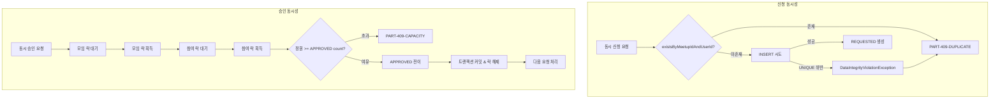

### 19.5 AC-PART-02 동시성 테스트

```java
@Test
@DisplayName("AC-PART-02: 정원 10명에 100명 동시 승인 → 최대 10명 APPROVED")
void approveParticipation_concurrent_shouldLimitToCapacity() throws Exception {
    // Given: capacity=10인 모임, 100명의 REQUESTED 참가자
    Meetup meetup = createMeetupWithCapacity(10);
    List<Participation> participations = createParticipations(meetup, 100);

    // When: 100개의 동시 승인 요청
    ExecutorService executor = Executors.newFixedThreadPool(20);
    CountDownLatch latch = new CountDownLatch(100);

    for (Participation p : participations) {
        executor.submit(() -> {
            try {
                participationService.approve(meetup.getId(), p.getId(), organizerId);
            } catch (BusinessException e) {
                // PART-409-CAPACITY 예상
            } finally {
                latch.countDown();
            }
        });
    }
    latch.await();

    // Then: APPROVED는 정확히 10명
    long approvedCount = participationRepository
        .countByMeetupIdAndStatus(meetup.getId(), ParticipationStatus.APPROVED);
    assertThat(approvedCount).isEqualTo(10);
}
```

---

## 20) 다음에 확장될 가능성이 높은 포인트

- 승인 동시성 통합 테스트 (AC-PART-02 대규모 동시 승인)
- 이메일 인증: 실 운영에서는 토큰을 URL로 전달하고, 인증 엔드포인트 공개 필요 가능성
- 성능 튜닝: 목록 조회 p95 300ms 목표 (M5)

---

**문서 최종 갱신: 2026-02-01**
필요하면 이 문서를 기반으로 **더 세부 설계 문서**까지 확장할 수 있다.
