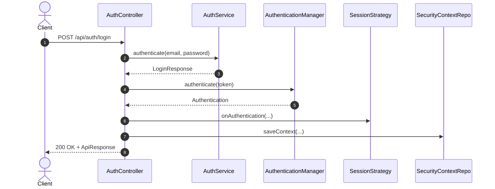
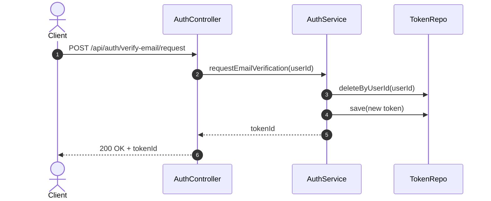
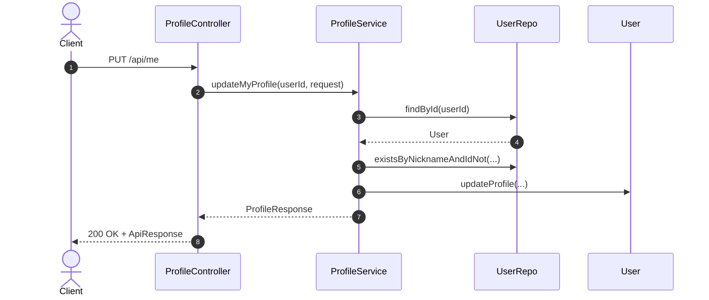

# Strive 코드베이스 가이드 (현재 구현 범위)

이 문서는 **현재까지 구현된 범위(M0/M1)**의 주요 코드가 **어떻게 동작하고 왜 이렇게 작성되었는지**를 설명한다.  
패키지 구조, 요청 흐름, 예외/응답 규격, 보안 설정, 테스트 구성까지 정리한다.

---

## 1) 애플리케이션 구조 개요

```
io.heygw44.strive
├── StriveApplication              # Spring Boot 엔트리포인트
├── domain
│   └── user                       # 사용자/인증/프로필 도메인
├── global
│   ├── config                     # 보안/스프링 설정
│   ├── exception                  # 예외 코드/핸들러
│   ├── filter                     # 공통 필터
│   ├── response                   # 공통 응답 포맷
│   └── security                   # 커스텀 UserDetails
└── support                        # 테스트용 컨트롤러
```

### 핵심 설계 의도
- **Controller는 얇게**, Service는 비즈니스 규칙을 담당.
- **도메인 엔티티가 상태 변경 책임**을 가진다.
- 예외는 **ErrorCode + BusinessException**으로 일관 처리.
- 보안(세션/CSRF)은 **Spring Security 표준 흐름**을 따른다.

---

## 2) 애플리케이션 시작

### `StriveApplication`
Spring Boot 앱의 엔트리 포인트다. 별도 설정 없이 기본 자동 구성으로 부팅된다.  
파일: `src/main/java/io/heygw44/strive/StriveApplication.java`

---

## 3) 공통 응답 포맷

### `ApiResponse<T>`
모든 정상 응답은 `{ data, traceId }` 형식으로 반환한다.  
`traceId`는 MDC에 저장된 값을 사용한다.
- 파일: `src/main/java/io/heygw44/strive/global/response/ApiResponse.java`

### `ErrorResponse`
에러는 `{ code, message, traceId, fieldErrors }` 형식으로 반환한다.  
Validation 에러는 `fieldErrors`에 필드별 메시지를 담는다.
- 파일: `src/main/java/io/heygw44/strive/global/response/ErrorResponse.java`
- 파일: `src/main/java/io/heygw44/strive/global/response/FieldError.java`

### `PageResponse<T>`
목록 응답을 위한 표준 페이지 포맷(현재 미사용).
- 파일: `src/main/java/io/heygw44/strive/global/response/PageResponse.java`

---

## 4) 공통 예외 처리

### `ErrorCode`
코드/메시지/HTTP 상태를 정의한다. 인증/검증/리소스 관련 에러들이 포함됨.
- 파일: `src/main/java/io/heygw44/strive/global/exception/ErrorCode.java`

### `BusinessException`
도메인/서비스 계층에서 비즈니스 규칙 위반 시 발생시키는 예외.
- 파일: `src/main/java/io/heygw44/strive/global/exception/BusinessException.java`

### `GlobalExceptionHandler`
모든 예외를 `ErrorResponse`로 매핑한다.
- `BusinessException` → 해당 ErrorCode로 응답
- `MethodArgumentNotValidException` → REQ-400 + fieldErrors
- `SessionAuthenticationException` → 동시 로그인 제한 처리
  - 파일: `src/main/java/io/heygw44/strive/global/exception/GlobalExceptionHandler.java`

---

## 5) Trace ID 필터 (요청 추적)

### `TraceIdFilter`
요청 헤더 `X-Trace-Id`를 확인하여 없으면 UUID 생성.  
MDC에 저장하고 응답 헤더에도 동일한 값을 내려준다.
- 파일: `src/main/java/io/heygw44/strive/global/filter/TraceIdFilter.java`

**의도**: 로그와 응답을 연동해 요청 단위 추적이 가능하게 한다.

---

## 6) 보안 설정

### `SecurityConfig`
Spring Security의 핵심 정책을 정의한다.
- CSRF: 쿠키 기반 토큰(`CookieCsrfTokenRepository`) 사용, 로그인/회원가입은 CSRF 제외
- 세션:
  - `sessionFixation().newSession()`으로 세션 고정 공격 방지
  - `maximumSessions(1)`로 동시 로그인 제한
  - `SessionAuthenticationStrategy`를 직접 적용하여 로그인 시 위 정책이 실제로 실행되도록 구성
- 인가:
  - `/api/auth/signup`, `/api/auth/login` 공개
  - `/api/me/**`, `/api/auth/logout`, `/api/auth/verify-email/**`는 인증 필요
  - `/api/meetups/**`, `/api/participations/**`는 메소드별 인증 요구
- 인증 실패 시 401로 응답

파일: `src/main/java/io/heygw44/strive/global/config/SecurityConfig.java`

---

## 7) 인증/회원 도메인

### 7.1 User 엔티티
`User`는 사용자 기본 정보 + 프로필 정보를 가진다.
- 이메일/닉네임은 유니크
- `isVerified`로 이메일 인증 여부 관리
- `updateProfile`은 **null이 아닌 값만 반영**(부분 업데이트)
- `verifyEmail()`로 인증 상태 전환

파일: `src/main/java/io/heygw44/strive/domain/user/entity/User.java`

### 7.2 EmailVerificationToken
이메일 인증 토큰을 관리한다.
- 토큰은 UUID로 생성, 해시 값만 저장
- 만료 시간 15분
- `isValid()`가 유효성 판단(미사용 + 만료 전)

파일: `src/main/java/io/heygw44/strive/domain/user/entity/EmailVerificationToken.java`

### 7.3 StringListConverter
`List<String>`을 JSON 문자열로 저장하기 위한 JPA 컨버터.
- null/빈 값은 `"[]"`로 저장
- 파싱 실패 시 빈 리스트 반환

파일: `src/main/java/io/heygw44/strive/domain/user/entity/StringListConverter.java`

### 7.4 Repository
JPA 기반 저장/조회 인터페이스.
- `UserRepository`: 이메일/닉네임 중복 검사
  - 파일: `src/main/java/io/heygw44/strive/domain/user/repository/UserRepository.java`
- `EmailVerificationTokenRepository`: 토큰 조회/삭제
  - 파일: `src/main/java/io/heygw44/strive/domain/user/repository/EmailVerificationTokenRepository.java`

---

## 8) 인증/프로필 서비스 계층

### 8.1 AuthService
인증 관련 비즈니스 규칙의 중심.
- 회원가입: 중복/비밀번호 길이 검증 → 비밀번호 해시 → 저장
- 로그인: 이메일로 사용자 조회 → 비밀번호 매칭
- 이메일 인증 요청: 기존 토큰 삭제 후 새 토큰 저장
- 이메일 인증 확인: 토큰 유효성/소유자 확인 후 인증 처리

파일: `src/main/java/io/heygw44/strive/domain/user/service/AuthService.java`

### 8.2 ProfileService
프로필 조회/수정 로직 담당.
- 조회: 사용자 존재 여부 확인 후 `ProfileResponse`로 변환
- 수정: 닉네임 중복 체크 후 `User.updateProfile` 호출

파일: `src/main/java/io/heygw44/strive/domain/user/service/ProfileService.java`

---

## 9) 컨트롤러

### 9.1 AuthController
인증/세션 관련 HTTP 엔드포인트 제공.
- `POST /api/auth/signup` : 회원가입
- `POST /api/auth/login` : 로그인 및 세션 발급
  - AuthenticationManager로 인증 후
  - `SessionAuthenticationStrategy` 적용
  - `SecurityContextRepository`에 저장
- `POST /api/auth/logout` : 세션 무효화
- `POST /api/auth/verify-email/request` : 이메일 인증 토큰 생성
- `POST /api/auth/verify-email/confirm` : 토큰 확인 후 인증 완료

파일: `src/main/java/io/heygw44/strive/domain/user/controller/AuthController.java`

### 9.2 ProfileController
- `GET /api/me` : 내 프로필 조회
- `PUT /api/me` : 내 프로필 수정 (부분 업데이트)

파일: `src/main/java/io/heygw44/strive/domain/user/controller/ProfileController.java`

---

## 10) DTO (요청/응답 모델)

### 요청 DTO
- `SignupRequest` : 이메일/비밀번호/닉네임 검증 포함
- `LoginRequest` : 이메일/비밀번호
- `ProfileUpdateRequest` : 닉네임/소개/지역/경험값 등 (부분 업데이트)
- `VerifyEmailConfirmRequest` : `"tokenId:rawToken"` 문자열

### 응답 DTO
- `SignupResponse`, `LoginResponse`, `ProfileResponse`

파일: `src/main/java/io/heygw44/strive/domain/user/dto/*`

---

## 11) API 시퀀스 다이어그램

### 로그인


### 이메일 인증 요청


### 프로필 수정


---

## 12) API 요청/응답 예시

### 회원가입
요청:
```http
POST /api/auth/signup
Content-Type: application/json

{
  "email": "new@example.com",
  "password": "password123",
  "nickname": "newuser"
}
```

응답:
```json
{
  "data": {
    "id": 1,
    "email": "new@example.com",
    "nickname": "newuser"
  },
  "traceId": "..."
}
```

### 로그인
요청:
```http
POST /api/auth/login
Content-Type: application/json

{
  "email": "test@example.com",
  "password": "password123"
}
```

응답:
```json
{
  "data": {
    "id": 1,
    "email": "test@example.com",
    "nickname": "testuser",
    "isVerified": false
  },
  "traceId": "..."
}
```

### 이메일 인증 토큰 요청
요청:
```http
POST /api/auth/verify-email/request
Content-Type: application/json
Cookie: JSESSIONID=...
```

응답:
```json
{
  "data": "token-id",
  "traceId": "..."
}
```

### 이메일 인증 확인
요청:
```http
POST /api/auth/verify-email/confirm
Content-Type: application/json
Cookie: JSESSIONID=...
X-CSRF-TOKEN: ...

{
  "token": "tokenId:rawToken"
}
```

응답:
```json
{
  "data": null,
  "traceId": "..."
}
```

### 내 프로필 조회
요청:
```http
GET /api/me
Cookie: JSESSIONID=...
```

응답:
```json
{
  "data": {
    "email": "test@example.com",
    "nickname": "testuser",
    "bioText": null,
    "preferredCategories": [],
    "homeRegionCode": null,
    "experienceLevel": null,
    "isVerified": false
  },
  "traceId": "..."
}
```

### 내 프로필 수정
요청:
```http
PUT /api/me
Content-Type: application/json
Cookie: JSESSIONID=...
X-CSRF-TOKEN: ...

{
  "nickname": "updatedNick",
  "bioText": "Updated bio text",
  "preferredCategories": ["HIKING", "CAMPING"],
  "homeRegionCode": "SEOUL_GANGNAM",
  "experienceLevel": "INTERMEDIATE"
}
```

응답:
```json
{
  "data": {
    "email": "test@example.com",
    "nickname": "updatedNick",
    "bioText": "Updated bio text",
    "preferredCategories": ["HIKING", "CAMPING"],
    "homeRegionCode": "SEOUL_GANGNAM",
    "experienceLevel": "INTERMEDIATE",
    "isVerified": false
  },
  "traceId": "..."
}
```

---

## 13) 보안용 사용자 정보

### `CustomUserDetails`
Spring Security가 사용하는 사용자 모델.  
`User`를 감싸며 `ROLE_USER` 권한 부여.

### `CustomUserDetailsService`
이메일로 사용자를 조회해 `CustomUserDetails`를 반환한다.

파일:
- `src/main/java/io/heygw44/strive/global/security/CustomUserDetails.java`
- `src/main/java/io/heygw44/strive/global/security/CustomUserDetailsService.java`

---

## 14) 테스트 구성

### 통합 테스트
Spring Boot + MockMvc 기반.
- `AuthIntegrationTest`: 로그인/세션 재발급/CSRF/401/토큰 형식 검증
- `ProfileIntegrationTest`: 프로필 조회/수정/중복 닉네임 검증
- `GlobalExceptionHandlerTest`: 검증/비즈니스 예외 응답 확인
- `TraceIdFilterTest`: TraceId 생성/반환 확인

파일:
- `src/test/java/io/heygw44/strive/domain/user/controller/AuthIntegrationTest.java`
- `src/test/java/io/heygw44/strive/domain/user/controller/ProfileIntegrationTest.java`
- `src/test/java/io/heygw44/strive/global/exception/GlobalExceptionHandlerTest.java`
- `src/test/java/io/heygw44/strive/global/filter/TraceIdFilterTest.java`

### 단위 테스트
Mockito 기반 서비스 테스트.
- `AuthServiceTest`: 회원가입/로그인/토큰 요청 검증

파일: `src/test/java/io/heygw44/strive/domain/user/service/AuthServiceTest.java`

---

## 15) 환경 설정

### `application.yaml`
기본 공통 설정.
- Jackson 시간대 UTC
- JPA Open Session 비활성화
- 세션 쿠키: `http-only=true`, `secure=true`, `same-site=lax`

파일: `src/main/resources/application.yaml`

### `application-local.yaml`
로컬 전용 설정.
- H2 인메모리 DB
- JPA create-drop
- 세션 쿠키 `secure=false` (로컬 HTTP 테스트용)

파일: `src/main/resources/application-local.yaml`

---

## 16) 개발 관점 요약 (왜 이렇게 작성했나)

1) **컨트롤러 얇게, 서비스에 규칙 집중**
   - 테스트와 유지보수에 유리.
2) **예외/응답 규격 통일**
   - 클라이언트가 에러 처리 일관되게 가능.
3) **보안은 표준 흐름**
   - 직접 구현보다 Spring Security 전략 사용이 안전.
4) **부분 업데이트는 null 보호**
   - 기존 데이터 손실 방지.

---

## 17) 다음에 확장될 가능성이 높은 포인트

- Meetup/Participation 도메인 추가 시:
  - `PageResponse` 활용 (목록/페이징)
  - 권한/상태 전이 ErrorCode 확장
- 이메일 인증: 실 운영에서는 토큰을 URL로 전달하고, 인증 엔드포인트 공개 필요 가능성

---

필요하면 이 문서를 기반으로 **더 세부 설계 문서(시퀀스 다이어그램, 상태 전이, API 스펙)**까지 확장해줄 수 있다.
